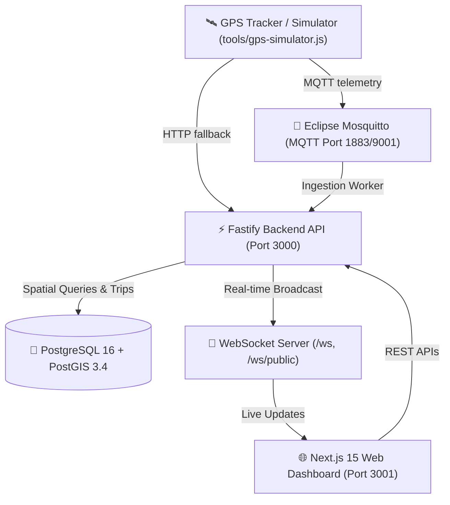

# 🚐 ระบบติดตามรถรับ-ส่ง (Shuttle Tracking System)

ระบบติดตามและบริหารจัดการรถรับ-ส่งแบบเรียลไทม์ (Full-Stack Real-time Fleet Tracking & Management System) ครบวงจร ทั้งระบบ Ingestion พิกัด GPS ผ่าน MQTT และ HTTP REST API, ฐานข้อมูลเชิงพื้นที่ PostGIS, WebSocket สำหรับกระจายพิกัดสด, Web Dashboard (Next.js 15) และเครื่องมือจำลองพิกัดรถ (GPS Simulator)

---

## 🏗️ สถาปัตยกรรมระบบ (Architecture)



### Tech Stack
- **Frontend:** Next.js 15 (App Router, TypeScript, Standalone Output), Tailwind CSS, Lucide Icons, Leaflet.js, OpenStreetMap
- **Backend:** Node.js 20 LTS, Fastify v5, `@fastify/websocket`, `@fastify/jwt`, `mqtt` client, `pg` pool
- **Database:** PostgreSQL 16 + PostGIS 3.4 (Partitioned `gps_points` table, Spatial GiST Index, Automated Seed Data)
- **Message Broker:** Eclipse Mosquitto 2.0 with ACL
- **Testing & Tooling:** Docker Compose, Node.js Native Test Runner (`node:test`), GPS Simulator CLI Tool

---

## 🚀 การติดตั้งและทดสอบบนเครื่อง Server / VM (Quickstart with Docker Compose)

### 1. Clone Repository
```bash
git clone https://github.com/fuzzfizz/dashboard-shuttle-tracking.git
cd dashboard-shuttle-tracking
```

### 2. ตั้งค่า Environment Variables (ถ้าต้องการปรับแต่ง)
```bash
cp .env.example .env
```
*(ค่าเริ่มต้นถูกตั้งไว้ให้พร้อมใช้งานทันทีโดยไม่ต้องแก้ไข)*

### 3. รันทั้งระบบด้วย Docker Compose
```bash
docker compose up -d --build
```

เมื่อสั่งรัน Docker จะเริ่มต้นการทำงานของ:
1. **`postgres`**: ติดตั้ง PostGIS และโหลด Schema พร้อม Seed Data จาก `database/migrations/` ให้อัตโนมัติ
2. **`mosquitto`**: MQTT Broker พอร์ต 1883
3. **`api`**: Fastify Backend API พอร์ต 3000
4. **`frontend`**: Next.js 15 Dashboard พอร์ต 3001

ตรวจสอบสถานะ Containers:
```bash
docker compose ps
```

---

## 🌐 การเข้าใช้งาน (Service URLs & Ports)

| บริการ | URL / พอร์ต | คำอธิบาย |
| :--- | :--- | :--- |
| **Public Live Map** | `http://<VM_IP>:3001` | หน้าแผนที่ติดตามรถสดสำหรับผู้โดยสาร (ไม่ต้องล็อกอิน) |
| **Admin Portal** | `http://<VM_IP>:3001/admin` | หน้าแดชบอร์ดภาพรวม จัดการรถ ดูประวัติเส้นทาง และรายงาน |
| **Admin Login** | `http://<VM_IP>:3001/login` | หน้าเข้าสู่ระบบของผู้ดูแลระบบ |
| **Backend API** | `http://<VM_IP>:3000/api/v1` | REST API สำหรับข้อมูลรถ เส้นทาง เที่ยววิ่ง และรายงาน |
| **WebSocket** | `ws://<VM_IP>:3000/ws` | Real-time Stream สำหรับ Admin |
| **WebSocket Public** | `ws://<VM_IP>:3000/ws/public` | Real-time Stream พิกัดรถสำหรับหน้าสาธารณะ |
| **MQTT Broker** | `mqtt://<VM_IP>:1883` | พอร์ตรับพิกัดจากกล่อง GPS Tracker |

### 🔑 บัญชีผู้ดูแลระบบเริ่มต้น (Default Accounts)
- **Admin:** `admin@example.com` / รหัสผ่าน: `admin123456`
- **Operator:** `viewer@example.com` / รหัสผ่าน: `viewer123456`

---

## 🛰️ การทดสอบยิงพิกัด GPS จำลอง (GPS Simulator)

ระบบมีเครื่องมือจำลองพิกัดรถรับ-ส่งตามเส้นทางจริงในกรุงเทพฯ พร้อมใช้งานในโฟลเดอร์ `tools/`:

### รันจำลอง 2 คัน ส่งผ่าน MQTT เข้า Mosquitto Broker:
```bash
node tools/gps-simulator.js --count 2 --protocol mqtt --broker mqtt://localhost:1883
```

### หรือรันจำลองส่งผ่าน HTTP REST API:
```bash
node tools/gps-simulator.js --count 2 --protocol http --api-url http://localhost:3000/api/v1
```

**ตัวเลือกคำสั่ง Simulator (CLI Options):**
- `--count, -n`: จำนวนรถจำลอง (1-10 คัน, ค่าเริ่มต้น: 2)
- `--protocol, -p`: `mqtt` หรือ `http` (ค่าเริ่มต้น: `mqtt`)
- `--interval, -i`: ความถี่ส่งพิกัดมิลลิวินาที (ค่าเริ่มต้น: `1000`)
- `--speed, -s`: ความเร็วรถเฉลี่ย km/h (ค่าเริ่มต้น: `30`)
- `--broker, -b`: URL ของ MQTT Broker
- `--api-url`: URL ของ Backend API

เมื่อรันเครื่องมือนี้ รถจะปรากฏบนแผนที่ `http://<VM_IP>:3001` และเคลื่อนที่แบบเรียลไทม์ทันที!

---

## 📱 ฟีเจอร์ของระบบ (Key Features)

1. **Public Live Tracking Map (`/`):**
   - แผนที่ OpenStreetMap + Leaflet ตอบสนองรวดเร็ว ไม่กระตุก
   - ไอคอนรถบัสหมุนตามทิศทางหัวรถ (Bearing/Heading)
   - ป้ายระบุสถานะ: กำลังวิ่ง (In Transit - เขียว), จอดนิ่ง (Idle - ส้ม), ออฟไลน์ (Offline - เทา)
   - ตัวกรองค้นหาตามทะเบียนรถ และเลือกดูเฉพาะสายรถที่ต้องการ
2. **Admin Fleet Overview (`/admin`):**
   - สรุปตัวเลขสถิติ Fleet Metrics: รถออนไลน์, รถที่กำลังวิ่ง, ระยะทางรวมวันนี้, เที่ยววิ่งที่เปิดอยู่
   - ตารางข้อมูลยานพาหนะสด 8 คอลัมน์ พร้อมปุ่มคลิกเพื่อกระโดดไปดูพิกัดบนแผนที่ทันที
3. **Vehicle Management & Remote Downlink (`/admin/vehicles`):**
   - เพิ่ม แก้ไข ลบข้อมูลรถรับ-ส่ง และกำหนดสายรถ
   - จัดการและคัดลอก `device_api_key` สำหรับนำไปตั้งค่าในกล่อง GPS Tracker
   - ส่งคำสั่งควบคุมไปยังอุปกรณ์ปลายทาง (Remote Commands):
     - ปรับความถี่การส่งพิกัด (`set_interval`: 1s, 2s, 5s, 10s, 30s)
     - สั่งรีบูตตัวกล่อง GPS (`reboot`)
     - ตรวจสอบสถานะและเช็กอัปเดตเฟิร์มแวร์ (`check_ota`)
4. **Trip History & Playback Visualizer (`/admin/trips`):**
   - ค้นหาประวัติเที่ยววิ่งย้อนหลังตามวันที่, ทะเบียนรถ, สายรถ และสถานะ
   - หน้าต่างเล่นภาพย้อนหลัง (Track Playback):
     - เส้นทางวิ่งจริงบนแผนที่ พร้อมหมุดจุดเริ่มต้น (Start) และจุดสิ้นสุด (End)
     - แถบเลื่อน Timeline (Scrubber) ขยับดูตำแหน่ง ณ เวลาใดๆ ได้
     - ปุ่มเร่งความเร็วการเล่น (1x, 2x, 5x, 10x)
     - สรุปสถิติเที่ยววิ่ง: ระยะทางรวม, ความเร็วเฉลี่ย, ความเร็วสูงสุด, ระยะเวลาเดินทาง
5. **Daily Mileage & Fleet Reports (`/admin/reports`):**
   - สรุปสถิติระยะทางและชั่วโมงการวิ่งรายวัน/ช่วงวันที่
   - ปุ่มลัดเลือกช่วงเวลา: วันนี้ (Today), เมื่อวาน (Yesterday), 7 วันล่าสุด (Last 7 Days), เดือนนี้ (This Month)
   - ปุ่ม **Export CSV (UTF-8 with BOM)** รองรับการเปิดใช้งานภาษาไทยใน Microsoft Excel ได้ถูกต้อง 100%

---

## 🧪 การรัน Automated Tests ทั้งระบบ

ระบบเขียนและทดสอบด้วย TDD (Test-Driven Development) ทุกโมดูล:

```bash
# 1. ทดสอบ Backend API, Services, WebSockets และ E2E Integration (135 tests)
cd backend && npm test

# 2. ทดสอบ GPS Simulator & Bearing Interpolation (6 tests)
cd ../tools && npm test

# 3. ทดสอบ Frontend Utilities, State Management & API/WS Client (47 tests)
cd ../frontend && npm test

# 4. ตรวจสอบ Next.js Production Build
cd ../frontend && npm run build
```

---

## 📄 ใบอนุญาต (License)
ISC License
