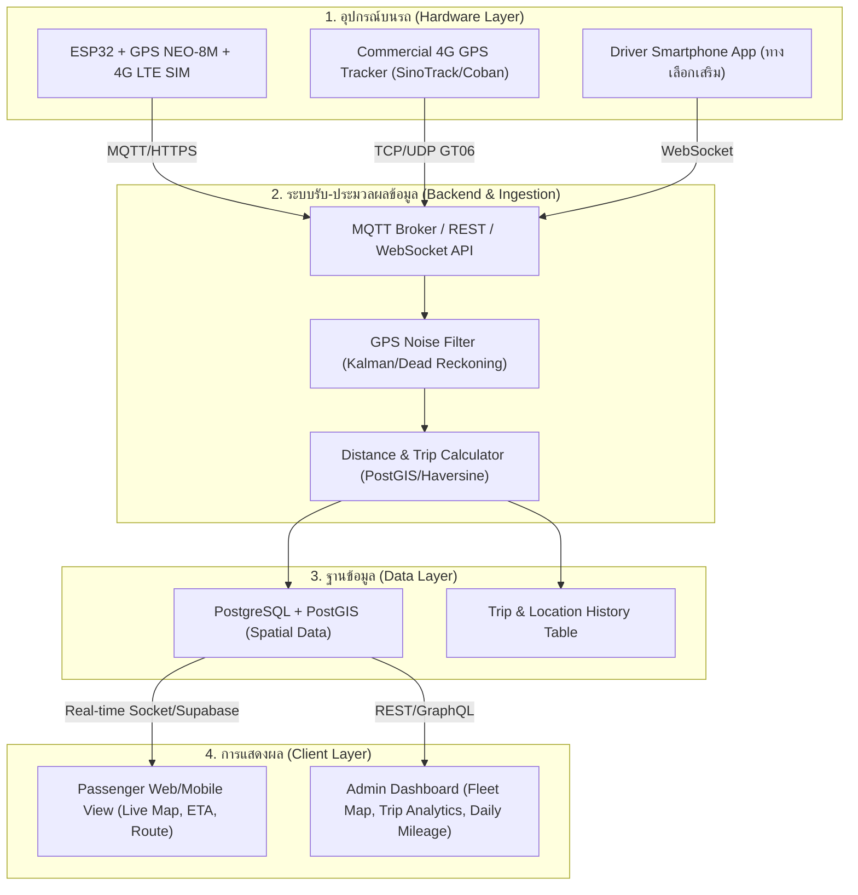
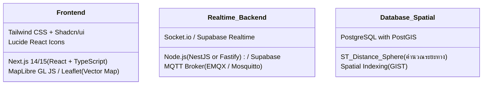
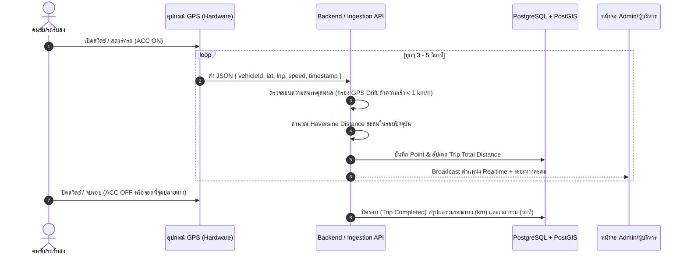
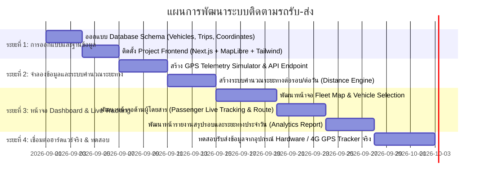

# แผนการศึกษาความเป็นไปได้และข้อเสนอแนะเทคโนโลยี: ระบบติดตามรถรับ-ส่ง (Shuttle Tracking System)

เอกสารนี้วิเคราะห์ความเป็นไปได้ทางเทคนิค สถาปัตยกรรมระบบ ตัวเลือกเทคโนโลยี ฮาร์ดแวร์ ซอฟต์แวร์ และแนวทางการคำนวณระยะทางเพื่อแก้ปัญหาตามโจทย์ใน [ระบบการติดตามรถรับ-ส่ง.md](file:///D:/shuttle-tracking-dashboard/%E0%B8%A3%E0%B8%B0%E0%B8%9A%E0%B8%9A%E0%B8%81%E0%B8%B2%E0%B8%A3%E0%B8%95%E0%B8%B4%E0%B8%94%E0%B8%95%E0%B8%B2%E0%B8%A1%E0%B8%A3%E0%B8%96%E0%B8%A3%E0%B8%B1%E0%B8%9A-%E0%B8%AA%E0%B9%88%E0%B8%87.md)

---

## 1. สรุปโจทย์และปัญหาที่ต้องการแก้ไข (Problem Statement)

| ปัญหาเดิม | ผลกระทบ | วิธีการแก้ไขด้วยระบบใหม่ |
| :--- | :--- | :--- |
| **1. ผู้โดยสารไม่รู้ตำแหน่งรถ** | เสียเวลารอ ไม่รู้ว่ารถจะมาถึงเมื่อไหร่ ไม่รู้ว่ารถอยู่ตรงไหน | แสดงตำแหน่งรถแบบ Real-time บนแผนที่ พร้อมแสดงเส้นทางและจุดจอด |
| **2. คนขับต้องจดบันทึกระยะทางเอง** | ข้อมูลคลาดเคลื่อน ลืมจด หรืออาจมีการปลอมแปลงตัวเลขระยะทาง | ระบบคำนวณระยะทางอัตโนมัติจาก GPS ต่อรอบและต่อวันแบบแม่นยำ ป้องกันการทุจริต |

---

## 2. การวิเคราะห์ความเป็นไปได้ทางเทคนิค (Feasibility Analysis)

> [!NOTE]
> **สรุปความเป็นไปได้**: ระบบนี้มี **ความเป็นไปได้ 100% (High Feasibility)** และเป็นเทคโนโลยีที่มีความเสถียร มีเครื่องมือและ Library รองรับครบวงจร

---

## 3. เปรียบเทียบตัวเลือกเทคโนโลยี (Technology Stack Options)

### 3.1 ด้านฮาร์ดแวร์ IoT (Hardware / Tracking Device)

| ตัวเลือก | รายละเอียด | ข้อดี | ข้อจำกัด | ความเหมาะสม |
| :--- | :--- | :--- | :--- | :--- |
| **Option A: Custom IoT (ESP32 + 4G SIM7600/A7670 + GPS NEO-8M)** | บอร์ด ESP32 ต่อโมดูล GPS + 4G, มีสวิตช์เปิด-ปิด, มีไฟ LED 3 ดวง (Power, GPS Fix, 4G Online) | ปรับแต่ง Protocol/Logic ได้ 100%, ต้นทุนอุปกรณ์ถูก (~800 - 1,500 บาท), รองรับ Sleep Mode เมื่อดับเครื่อง | ต้องออกแบบเคส วงจรสเต็ปดาวน์ไฟรถยนต์ (12V to 5V) และเขียน Firmware C++/MicroPython | **เหมาะมาก** หากต้องการพัฒนาผลิตภัณฑ์ของตนเอง |
| **Option B: Commercial 4G GPS Tracker (เช่น SinoTrack ST-901L / Coban GPS-303)** | กล่อง GPS Tracker สำเร็จรูป ต่อสายไฟรถยนต์ (ACC line, Battery) | ทนทาน กันน้ำ มีแบตเตอรี่สำรองในตัว มีใบรับรองความปลอดภัย ติดตั้งง่าย | โปรโตคอลเป็นมาตรฐานเฉพาะ (เช่น GT06) ต้องทำ Gateway Parser | **แนะนำสำหรับความทนทานและพร้อมใช้ทันที** |
| **Option C: Driver Web/Mobile App** | ใช้ GPS จากสมาร์ทโฟนของคนขับส่งพิกัดผ่าน Web App / Flutter | ไม่ต้องซื้ออุปกรณ์ฮาร์ดแวร์ ใช้มือถือคนขับที่มีอยู่แล้ว | ขึ้นอยู่กับแบตเตอรี่มือถือคนขับ และคนขับอาจลืมเปิดแอปหรือปิด GPS | เหมาะสำหรับ Prototype หรือเป็นระบบสำรอง |

---

### 3.2 ด้านสถาปัตยกรรมซอฟต์แวร์ (Software & Web Stack)

#### แนะนำชุดเทคโนโลยีหลัก (Recommended Modern Stack):

1. **Frontend Dashboard & Passenger View:**
   - **Framework**: **Next.js 14/15** (App Router, React 19, TypeScript) หรือ **Vite + React**
   - **Styling & UI**: **Tailwind CSS** + **Shadcn/UI** (สวยงาม ทันสมัย Responsive รองรับทั้งมือถือและจอคอม)
   - **Map Engine**: **MapLibre GL JS** หรือ **Leaflet.js** (เปิดเสรี ไม่มีค่าใช้จ่าย API รายครั้ง)
   - **Map Tiles & Routing**: OpenStreetMap (OSM) / CartoDB Voyager / Stadia Maps หรือ Google Maps API (ถ้าต้องการความละเอียดสูง)

2. **Backend & Real-time Telemetry:**
   - **Option 1 (Supabase-driven - รวดเร็ว ดูแลง่าย)**: Supabase (PostgreSQL + PostGIS + Realtime Broadcast + Auth) 
   - **Option 2 (Custom Node.js/Go Backend - ยืดหยุ่นสูงสุด)**: NestJS / Fastify + MQTT Broker (EMQX) + WebSockets

3. **Database & Spatial Calculation (ฐานข้อมูลและการวัดระยะทาง):**
   - **PostgreSQL + PostGIS**: รองรับฟังก์ชันทางภูมิศาสตร์ เช่น:
     - `ST_Distance(geom1, geom2)` เพื่อหาระยะทางระหว่างพิกัด
     - `ST_MakeLine(geom)` เพื่อวาดเส้นทางย้อนหลังของแต่ละรอบ (Trip Polyline)
     - `ST_Contains(geofence, current_loc)` ตรวจสอบว่ารถเข้าสู่สถานี/ป้ายรับส่งแล้วหรือยัง

---

## 4. แนวทางการทำงานของฟีเจอร์หลัก (Feature Breakdown & Logic)

### 4.1 การวัดระยะทางและการคำนวณรอบวิ่งอัตโนมัติ (Anti-Tampering Mileage Calculation)

> [!IMPORTANT]
> **แก้ปัญหาคนขับบันทึกระยะทางเองและป้องกันการปลอมแปลง:**
> ระบบจะตัดคนขับออกจากขั้นตอนการลงบันทึกตัวเลข โดยใช้การประมวลผลอัตโนมัติจากฝั่ง Server

#### สูตรและอัลกอริทึมที่ใช้:
1. **Haversine Formula / PostGIS `ST_DistanceSphere`**: คำนวณระยะทางทางภูมิศาสตร์ระหว่างคู่พิกัด $(lat_1, lng_1)$ และ $(lat_2, lng_2)$
2. **Speed & Noise Threshold Filter**: ไม่นำจุดที่ขยับเนื่องจาก GPS Drift ตอนรถจอดนิ่ง (Speed < 1.5 km/h หรือ ระยะเคลื่อนที่ < 3 เมตร) มาคิดเป็นระยะทางสะสม
3. **Automatic Round/Trip Trigger (Geofencing)**:
   - ตรวจจับว่ารถออกจาก "จุดเริ่มต้น" -> เริ่มรอบใหม่อัตโนมัติ (Trip Start)
   - รถกลับมาถึง "จุดปลายทาง/สถานี" -> บันทึกจบรอบอัตโนมัติ (Trip Finish)
   - สรุประยะทางรายรอบ (Distance per Round) และผลรวมรายวัน (Daily Total Distance) อัตโนมัติ

---

### 4.2 หน้าจอแสดงผล (Software Interface Specification)

#### 1. หน้าสำหรับผู้โดยสาร (Passenger View - Mobile Friendly)
- แผนที่แสดงตำแหน่งรถแบบ Real-time พร้อมไอคอนรถหมุนตามทิศทาง (Heading)
- เส้นทางที่รถกำลังวิ่ง (Planned Route) และจุดรับ-ส่ง (Stops/Stations)
- การ์ดสถานะ: หมายเลขรถ, ทะเบียน, ความเร็วปัจจุบัน, เวลาที่คาดว่าจะถึงจุดถัดไป (ETA)

#### 2. หน้าสำหรับผู้ดูแลระบบ (Admin Fleet Dashboard)
- **Fleet Live Overview**: ดูรถทุกคันในระบบพร้อมกันบนแผนที่เดียว มี Filter ตามสายรถ/สถานะ (วิ่งอยู่, จอดพัก, ออฟไลน์)
- **Vehicle Detail Modal**: เมื่อคลิกที่รถแต่ละคัน จะแสดง:
  - พิกัดสด + เส้นทางที่วิ่งไปแล้วในรอบปัจจุบัน (Breadcrumb trail)
  - ข้อมูลรอบการวิ่งประจำวัน (ตารางแสดง: รอบที่, เวลาเริ่ม-จบ, ระยะทางกิโลเมตร, สถานะ)
- **Daily & Monthly Report**: ตารางสรุประยะทางรวมของรถแต่ละคันต่อวัน กราฟเปรียบเทียบระยะทาง และปุ่ม Export เป็น Excel / PDF

---

## 5. การวิเคราะห์ต้นทุนและงบประมาณ (Cost Estimation)

| หมวดหมู่ | รายการ | ค่าใช้จ่ายประมาณการ |
| :--- | :--- | :--- |
| **ฮาร์ดแวร์ (ต่อคัน)** | บอร์ด ESP32 + 4G Module + GPS หรือ Commercial GPS Tracker 4G | 900 - 1,800 บาท / คัน (จ่ายครั้งเดียว) |
| **ซิมการ์ด IoT (ต่อคัน)** | ซิมเน็ต IoT สำหรับส่งข้อมูล GPS (ใช้ Data ประมาณ 50-100 MB/เดือน) | ~30 - 60 บาท / เดือน / คัน |
| **Cloud Server / Backend** | VPS (เช่น DigitalOcean / Hetzner / AWS Lightsail) หรือ Supabase Free/Pro | 0 - 800 บาท / เดือน (สำหรับระบบขนาด 1-50 คัน) |
| **Map & Routing API** | ใช้ MapLibre + OpenStreetMap (Self-hosted or Open Tiles) | ฟรี 100% ไม่มีค่าบริการราย Request |

---

## 6. แผนการดำเนินงานพัฒนา (Implementation Roadmap)

---

## 7. สรุปและขั้นตอนถัดไป (Next Steps)

1. **เลือกแนวทางฮาร์ดแวร์**: ตัดสินใจเลือกระหว่างสร้างกล่อง ESP32 4G เอง หรือใช้กล่อง Commercial 4G GPS Tracker สำเร็จรูป
2. **เริ่มพัฒนาซอฟต์แวร์ต้นแบบ (MVP Software)**:
   - เริ่มต้นโครงสร้างโปรเจกต์ Next.js Dashboard
   - สร้าง Mock GPS Streamer เพื่อทดสอบการแสดงผลแผนที่แบบ Real-time และอัลกอริทึมวัดระยะทาง
   - พัฒนาระบบสรุปรายงานระยะทางต่อรอบและต่อวัน
