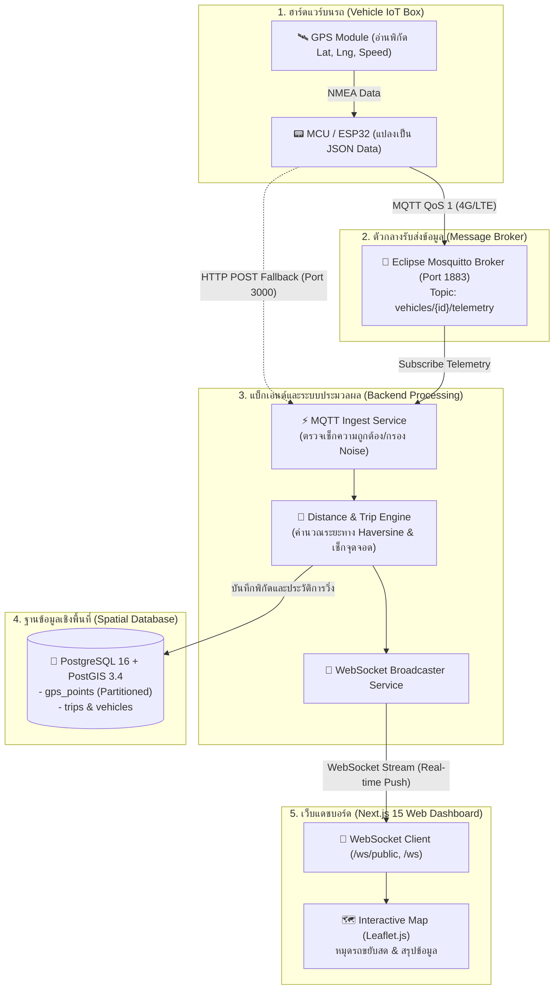
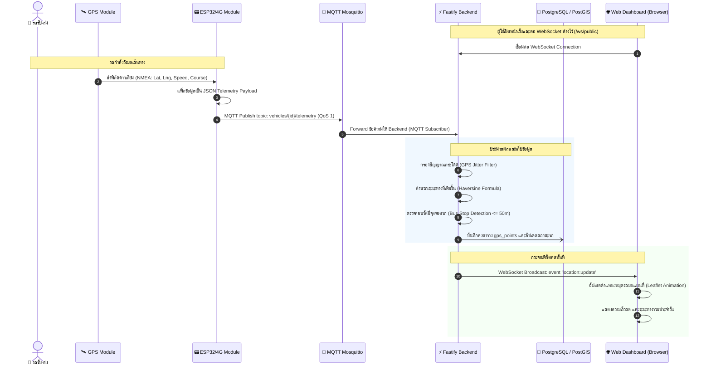

# 🚐 กระบวนการทำงานตั้งแต่ฮาร์ดแวร์จนถึงเว็บ (End-to-End Process Flow)

เอกสารนี้แสดงโฟลว์การทำงานตั้งแต่การเก็บพิกัดดาวเทียมของกล่อง GPS บนรถ จนถึงการแสดงผลสดบน Web Dashboard

---

## 1. Flowchart สถาปัตยกรรมและการไหลของข้อมูล (System Architecture Flow)



---

## 2. ลำดับเวลาการทำงาน (Sequence Diagram)



---

## 3. รายละเอียด Payload ข้อมูล (Data Contract)

### 3.1 ข้อมูลพิกัดที่ฮาร์ดแวร์ส่ง (Telemetry Payload)
```json
{
  "lat": 13.7563,
  "lng": 100.5018,
  "speed": 35.5,
  "heading": 180,
  "timestamp": "2026-09-16T08:30:00.000Z",
  "acc": true
}
```

### 3.2 ข้อมูลที่สตรีมผ่าน WebSocket ให้หน้าเว็บ (Broadcast Payload)
```json
{
  "event": "location:update",
  "data": {
    "vehicle_id": "d0000000-0000-0000-0000-000000000001",
    "plate_number": "กข-1234",
    "lat": 13.7563,
    "lng": 100.5018,
    "speed": 35.5,
    "heading": 180,
    "status": "online",
    "trip_id": "t1000000-0000-0000-0000-000000000001",
    "daily_distance_km": 14.2,
    "updated_at": "2026-09-16T08:30:00.000Z"
  }
}
```
